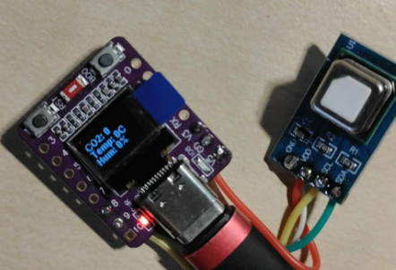
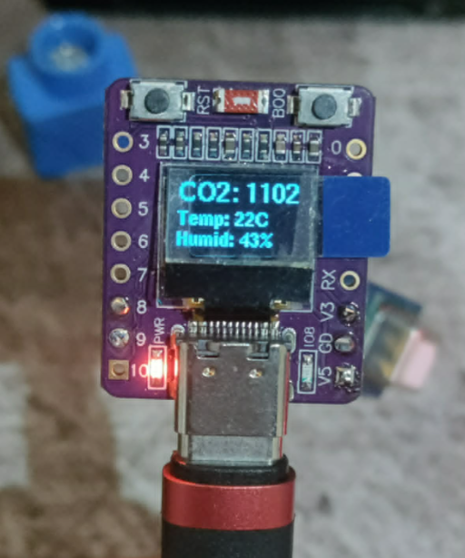

# 🍃 Pocket CO2 Monitor (ESP32-C3 + SCD41 + OLED)

A ultra-compact, pocket-sized carbon dioxide (CO2), temperature, and humidity monitor built using the **ESP32-C3 (0.42-inch OLED development board)** and the high-precision **Sensirion SCD41** photoacoustic sensor.

---

## 📸 Gallery

  
  

---

## ✨ Features
* **Pocket-Sized Design:** Built on a miniature ESP32-C3 board with an integrated 0.42" SSD1306 OLED display.
* **Software I2C Fix (Crucial):** Solves hardware resource locking issues. By switching the OLED display to a software-emulated I2C bus (`SW_I2C`), it prevents electrical hang-ups and resource conflicts on the ESP32-C3 chip.
* **Precise Environment Tracking:** Real-time monitoring of CO2 levels (ppm), Temperature (°C), and Relative Humidity (%).

---

## 📁 Repository Structure & Firmware Versions

This repo contains two versions of the firmware:

1. **`co2_monitor_basic.ino`** *(Initial Version)* 
   * The first functional code. It uses a smaller, basic font where data fields are tightly packed next to each other to fit the miniature screen size - (debugged the initial Software I2C conflicts)
   * author: **[kkastinger](https://github.com/kkastinger)** 
2. **`co2_monitor_optimized.ino`** *(Refined Version)* 
   * The upgraded version featuring optimized code architecture and a cleaner, much sharper, high-definition typography for easier reading.
   * author: **[TheAbsurdator](https://github.com/TheAbsurdator)**

---

## 🛠️ Wiring Diagram

The Sensirion SCD41 sensor connects directly to the ESP32-C3 board using standard I2C lines, while the integrated OLED runs on separate pins via a software emulated bus to avoid collisions.

| Sensor Pin | Function | ESP32-C3 Board Pin |
| :---: | :--- | :--- |
| **VDD** | Power Supply | **V3** (3.3V) |
| **GND** | Ground | **GD** (GND) |
| **SDA** | I2C Data | **GPIO 8** |
| **SCL** | I2C Clock | **GPIO 9** |

*Note: The built-in OLED display is driven by Software I2C using **GPIO 5 (Data)** and **GPIO 6 (Clock)**.*

---

## 💻 Tech Stack & Libraries
The project is written in C++ using the Arduino IDE framework. The following libraries are required:

* [U8g2](https://github.com/olikraus/u8g2) - For driving the integrated 0.42" SSD1306 OLED screen over Software I2C.
* `bb_scd41` - A lightweight library for managing the Sensirion SCD41 photoacoustic sensor.

---

## ⚙️ Setup & Configuration

1. **Baud Rate:** Ensure your *Serial Monitor* is set to **115200 baud** to read live telemetry logs correctly.
2. **First Read Calibration:** The SCD41 sensor takes a brief moment to initialize properly. The code includes a short delay sequence on startup to ensure accurate initial readings rather than generic zeros.
3. ** Quick Test:** To verify that everything is working dynamically without professional testing equipment, simply **blow/exhale gently directly onto the SCD41 sensor**. Because human breath contains a high concentration of carbon dioxide, you will immediately see a massive spike in the CO2 ppm values on both the OLED screen and the Serial Monitor log!

---

## 👥 Credits & Collaboration

This project was a team effort, Thanks to:
* **[TheAbsurdator](https://github.com/TheAbsurdator)** - Hardware mastermind responsible for the precise soldering work, optimizing the layout, improving the code architecture, and implementing the better, sharper OLED typography.
* **[kkastinger](https://github.com/kkastinger)** - Software dev, logic implementation, and debugging the initial Software I2C conflicts.

